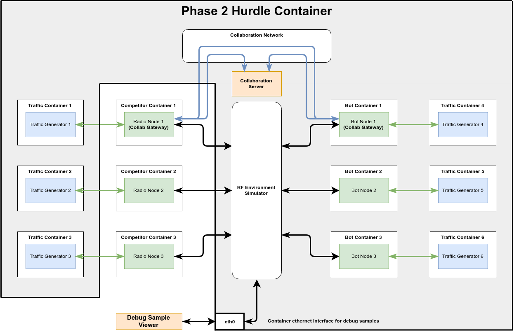
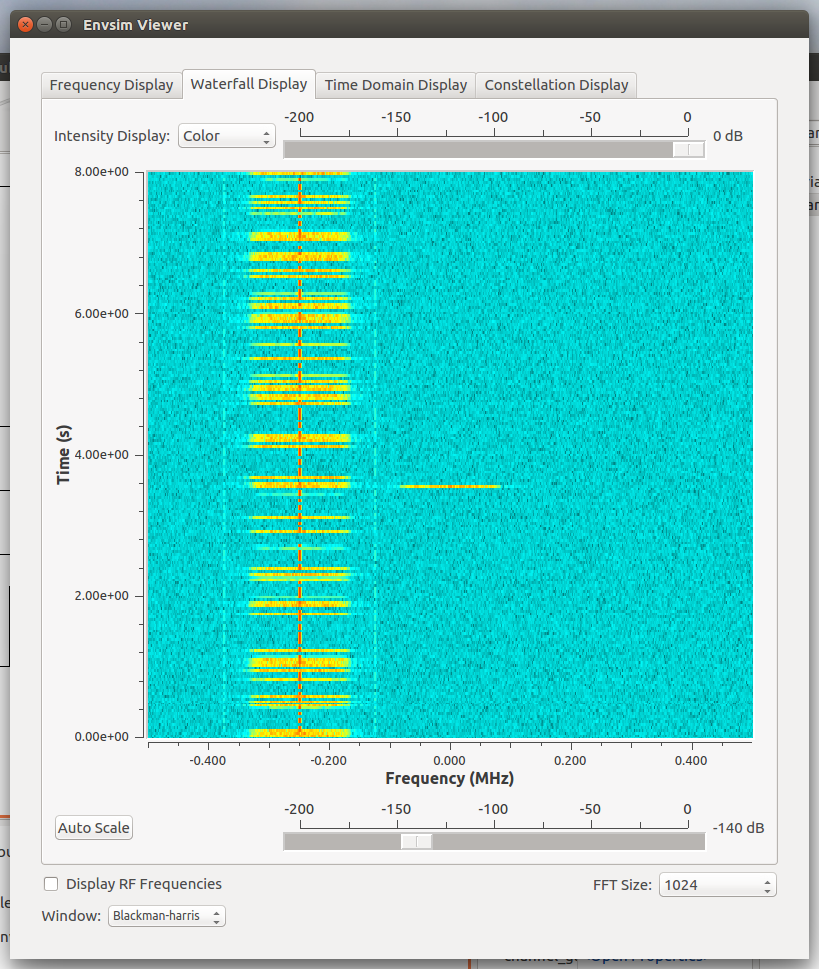
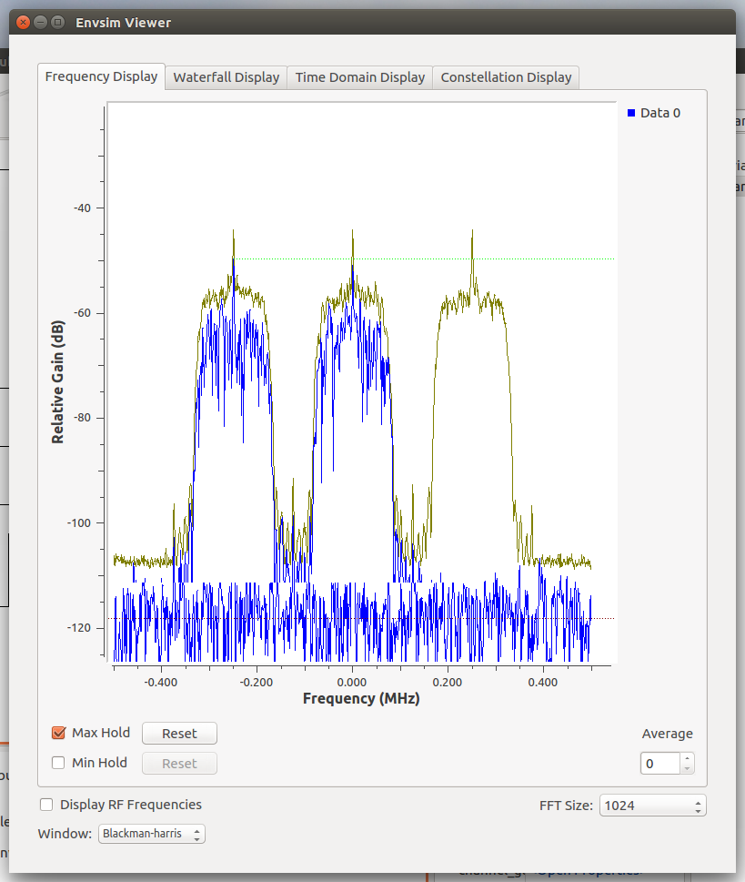
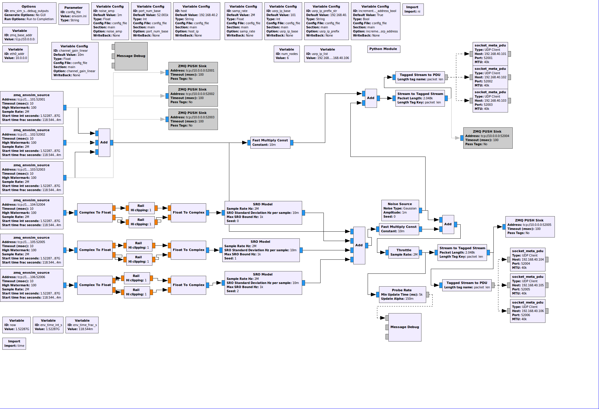

https://spectrumcollaborationchallenge.com

# ENVSIM Debug Mode

## Introduction

The hurdle execution script has a debug mode that can stream samples out over a network interface
for visualization by an external viewer.



An example viewer is included in the phase2-hurdle repository at gr-envsim/apps/envsim_viewer.grc.

You will need to have a build of GNU Radio with QT and ZMQ components enabled wherever this viewer
runs. If an appropriate build of GNU Radio is installed on your host machine, you may run the viewer
directly on your host. See https://www.gnuradio.org/ for details on installing GNU Radio.

You can also run the viewer from inside the top level hurdle container if you install a desktop
environment and remote access server. See [Hurdle Debug Additional Tools](Hurdle-Debug-Additional-Tools.md)
for instructions on how to configure your top hurdle container to support this.

## Launching the Example Debug Viewer

The ENVSIM debug mode streams debug samples to the IP address associated with eth0 in the top
level hurdle container.

You will need to point the debug viewer to this IP address. Look up the IP address associated with
the top level hurdle container's eth0 interface by running the following command from your host:

```bash
lxc list
```

You should see results that look like:

```bash
+------------------------+---------+--------------------------------+------+------------+-----------+
|          NAME          |  STATE  |              IPV4              | IPV6 |    TYPE    | SNAPSHOTS |
+------------------------+---------+--------------------------------+------+------------+-----------+
| phase2Hurdle-v2-1-0    | RUNNING | 192.168.40.2 (usrpbr0)         |      | PERSISTENT | 0         |
|                        |         | 192.168.106.100 (trbr6)        |      |            |           |
|                        |         | 192.168.105.100 (trbr5)        |      |            |           |
|                        |         | 192.168.104.100 (trbr4)        |      |            |           |
|                        |         | 192.168.103.100 (trbr3)        |      |            |           |
|                        |         | 192.168.102.100 (trbr2)        |      |            |           |
|                        |         | 192.168.101.100 (trbr1)        |      |            |           |
|                        |         | 172.30.101.1 (colbr0)          |      |            |           |
|                        |         | 172.16.1.1 (canbr0)            |      |            |           |
|                        |         | 10.169.25.92 (eth0)            |      |            |           |
+------------------------+---------+--------------------------------+------+------------+-----------+
```

Look for the IP address on the line containing eth0. In this case, that IP address is 10.169.25.92.

### Launching the Example Debug Viewer from the Hurdle Container

If you intend to run the example viewer from inside the top level hurdle container, you'll need to
run it as a non-root user. The GUI will not display properly and you'll see error messages if you
try to run it as root.

As envsim_viewer.py is stored under the root directory, and this directory is only visible to the
root user, you'll need to copy the envsim_viewer.py file elsewhere. For this example, we'll assume
you've already followed [Hurdle Debug Additional Tools](Hurdle-Debug-Additional-Tools.md) to install
an SSH server and activate the ubuntu user.

Log in to the top level hurdle container over SSH at the eth0 IP address you found earlier and copy
the example viewer to the ubuntu home directory using:

```bash
ssh ubuntu@10.169.25.92
```

then:

```bash
su root
cp /root/phase2-hurdle/gr-envsim/apps/envsim_viewer.* /home/ubuntu/
chown ubuntu:ubuntu /home/ubuntu/envsim_viewer.*
exit
```

You should now be able to start the envism_viewer by running:

```bash
./envsim_viewer.py --debug-ip=10.169.25.92 --port-num=52005
```

You should see a window pop up with multiple tabs. It won't be doing anything until you start
ENVSIM in debug mode.

### Launching the Example Debug Viewer from your Host

To run the example viewer from your host instead of inside the hurdle container, clone the
phase2-hurdle repository to your host and navigate to the gr-envsim/apps subdirectory.

Assuming you have GNU Radio, QT, and ZMQ all properly installed on your host, you should be able to
start the envism_viewer by running:

```bash
./envsim_viewer.py --debug-ip=10.169.25.92 --port-num=52005
```

You should see a window pop up with multiple tabs, all showing blank plots.
It won't be doing anything until you start ENVSIM in debug mode.


## Running ENVSIM in Debug Mode

Running in debug mode does take some external compute resources. Ensure your development machine
has enough computational headroom to handle it. The envsim may also stop processing samples
if a debug viewer is not running and consuming all the debug samples generated by debug mode.

To run the hurdle in debug mode, execute the following commands from inside your top level hurdle
container:

```bash
cd /root/phase2-hurdle/hurdle_execution
./run_hurdle.py --duration=600 --image-file=dummy-image.tar.gz --clean-competitor-containers --container-boot-timeout=15 --enable-debug-output
```

This enables a debug mode and reduces the amount of time the hurdle will wait before starting up.
The default boot timeout is 5 minutes, so this can save a considerable amount of time if your
competitor container doesn't correctly report via radio_api that it has booted.

The ENVSIM debug mode adds a ZMQ Push Sink that taps off the sample stream normally sent back to
competitor containers. This ZMQ Push Sink takes chunks of samples, encapsulates them in the ZMQ
Transport Protocol, and makes them available to a ZMQ Pull Sink listening at the appropriate
endpoint.

You should now see the plots on the example ENVSIM viewer updating. You can choose between
frequency, waterfall, and time based plots.

This is an example waterfall plot showing the Hurdle Bot network communicating:



This is what the frequency plot looks like:



### Modifying the Debug Flowgraph

The version of the debug flowgraph that is included in the Hurdle container has only one ZMQ Push
sink currently enabled. Users may edit the
/root/phase2-hurdle/gr-envsim/apps/env_sim_server_debug_outputs.grc file using gnuradio-companion to
enable additional sinks if preferred. These sinks currently show up in grey when viewing
env_sim_server_debug_outputs.grc in gnuradio-companion. See below for a screenshot of the flowgraph
in gnuradio-companion:



Select one of the disabled blocks and press the "e" key to enable it. Press the "d" key to disable
it again.

When making any changes, ensure that the gnuradio-companion autogenerated Python file containing
your changes is saved to /root/phase2-hurdle/gr-envsim/apps/env_sim_server_debug_outputs.py in the
hurdle container. This is the file that the run_hurdle.py script executes when you
specifiy the --enable-debug-output command line argument.
